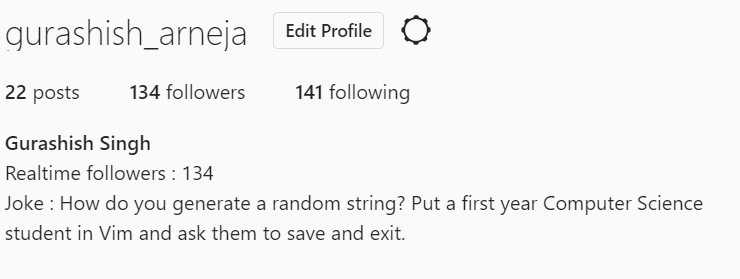

# Instagram real-time account bio updater.

This is a simple Python Script built using selenium and pyjokes that updates the bio if the follower count of an account changes. The bio will show a follower counter and a joke that changes as the account gets/loses a follower

## Example

How it will look:



## Required Steps

- Before you run, you will need to edit the code at line 42, and specify the path of your chrome web-driver (or whichever web-driver you want to use.). The current code at line 42 looks like :

  `browser = webdriver.Chrome(r"C:\Users\guras\Downloads\chromedriver_win32\chromedriver.exe")`

- Enter your web-driver path in the " ".

- Chrome Web-driver can be downloaded from here - https://chromedriver.chromium.org/downloads

  

  ### Ways to RUN

  #### Way 1

- One way to run is to clone this repository and open in Pycharm. Once opened install Selenium using the command 

  `pip install selenium`

  and `pip install pyjokes`

  through Pycharm terminal. Once installed, Edit the Run/Debug Configurations and then run the script. 

  

  #### Way 2

- If on Linux you will need to have python installed, and pip as well. The steps are given below. 

- You will need to have python 3 installed. If you have not installed that, you can using this command

  ```
  sudo apt-get update
  sudo apt-get install python3.6
  ```

- You can check if python is installed using:

  ```
  python3 --version
  ```

- After this you will also have to install pip python utility in Linux. This is because the project uses some external libraries that an be  only installed through pip. You can do that using the command below.

  ```
  sudo apt install python3-pip
  ```

- Once pip is installed, install selenium external library using command

  ```
  sudo pip install selenium
  ```

- Once pip is installed, install py-jokes library as well.

  ```
  sudo pip install pyjokes
  ```

- Now you can run the script with command.

  ```
  python3 insta.py
  ```

  

## Runtime

The time it takes for change to appear in the bio depends. 

The best case scenario is = 3 secs

The worst case scenario is = 9 secs

This is because I can only send up to around 670 requests in an Hour to Instagram to get the follower count before the IP address gets blocked.

To compensate for this limit, the script only checks every 6 secs. This way the IP address doesn't get blocked. 

## Important Note

Since Instagram keep on making small changes to their UI regularly/ frequently (sometimes monthly), There is a chance this script might not work in future. I will try to keep this script updated as these changes happen. 

The script works fully as of Aril 30, 2020.

If you find that the script doesn't work anymore shoot me an email.

## Support

For any questions contact  me at [gurashish1000@gmail.com](mailto:gurashish1000@gmail.com)
